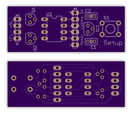
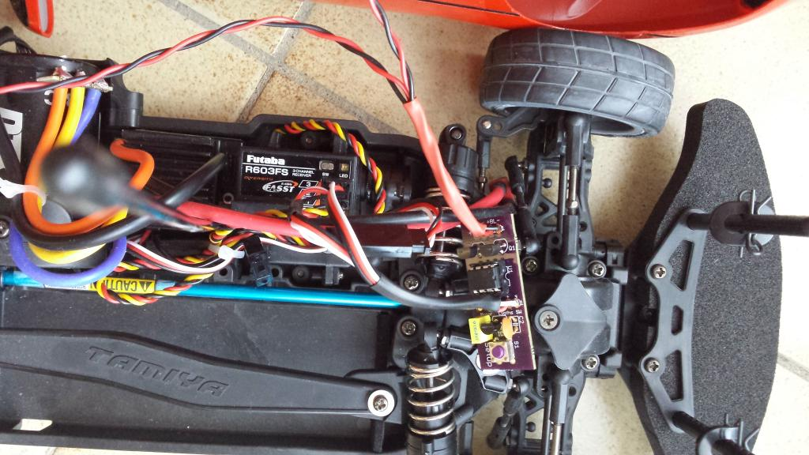

# RC Ligths control system

### Basic feature list:
* Two On/Off (PWM) outputs (fronts lights and rear lights)
* Two inputs (radio signal) (engine, and lights switch)
* One setup button.

### More descriptive feature:
The system captures the engine level, and switch on the rear lights when breaking. The lights switch (on a 3rd chanel) allows to switch on/off the front lights and the rear ligths at 30% power (night mode).

The current software works for a RC Lights control system.

However, the hardware platform could be retrofited for any uses cases requirering 2 PWM outputs and 2 IN/OUT radio signal channels.
It is based on a PIC 12F1840, programmable directly in C (I used MPLABX for this project...)

### Some hardware details:
* MCU is a PIC12F1840, low power
* MCU powered at 3.3V linear regulator (ideally LDO to support low BEC)
* The two output have BS170 (N-Mosfet) supporting up to 500mA continuous load

The PCB is single face, with through hole components. It could be easily be converted int a surface mount PCB, thus reducing further the size of the PCB (basically the size of the button+connector). Please let me know if you are interested...

